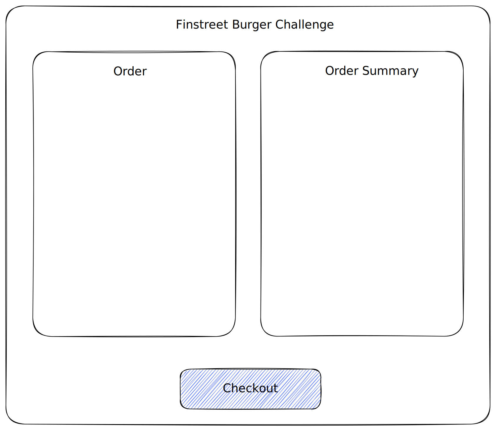

# Finstreet Burger Challenge

## Task
We are working at a burger place and have to create a UI for our customers to order their burgers. The burger place offers three different burgers with the following prices:

- hamburger --> 5.0
- cheesseburger --> 6.0
- chilli cheeseburger --> 8.0

which all come in three different sizes that modify the price by a factor:

- small (s) --> * 0.7
- medium (m) --> * 1.0 
- large (l) --> * 1.3

The customer wants to add multiple burgers to his order and select a different size for each burger. Since the customer does not want to rely on his own math skills we should provide him with the display to see all burgers he ordered with the actual price of the burger.

To stay competitive with other burger restaurants we offer several ways to our customer to save money. There are different promotion codes that will offer two specific burgers to the price of one burger to the customer. Additionally, we want to offer the customer discount codes which deduct a percentage amount of the whole order price. Our manager wants the customer to add exactly one promotion code and one discount code to his order. The checkout display should show the price reduction from the promotion and discount code. 

After confirming the order we want to redirect the customer to a success page and show him that his order was successful, and he will receive his order soon.

## Libraries
You can use libraries that you are most familiar with and that you think fit this use case and explain your choice later in the interview.

## UI

The UI should roughly look like the image above as a guideline. You can freely decide how to arrange the input fields inside the order part. The order summary should display all ordered burgers with their size and price. Below we want to show the customer how much he saves with the promotion code and how much is deducted with his discount code. Clicking on the checkout button at the bottom should display an alert to the customer that his order was successful and the amount he paid.

## Advanced
You do not have to learn these technologies if you do not have the experience with them at the moment. It is definitely possible to complete the challenge without these advanced tasks.

### TypeScript
We are using TypeScript in all of our projects and want to make use of it as much as possible. It is fine to use `any` in this coding challenge, but you can show off your TypeScript skills by using types throughout the application and having type safety where possible

## How to work
Start by cloning this project on your machine, finish the task and create a repository on your personal GitHub account. After you are done with the coding challenge you should invite your reviewers to the repository so that they can prepare the review and the second interview with you based on your given solution.You will receive the GitHub names in your invitation to the next interview. In this interview you will be able to present your solution and answer our potential questions.

### Use all available tools
This coding challenge should be as close to a real project as possible. We *want* you to use tools like ChatGPT or GitHub Copilot to see the quality of your code with the available tools.

### Timeframe
We estimate that you can complete the project in around 4 hours and should not use way more time than this. Even if some tasks or features are not finished after four hours we still get valuable feedback about your way of work.

